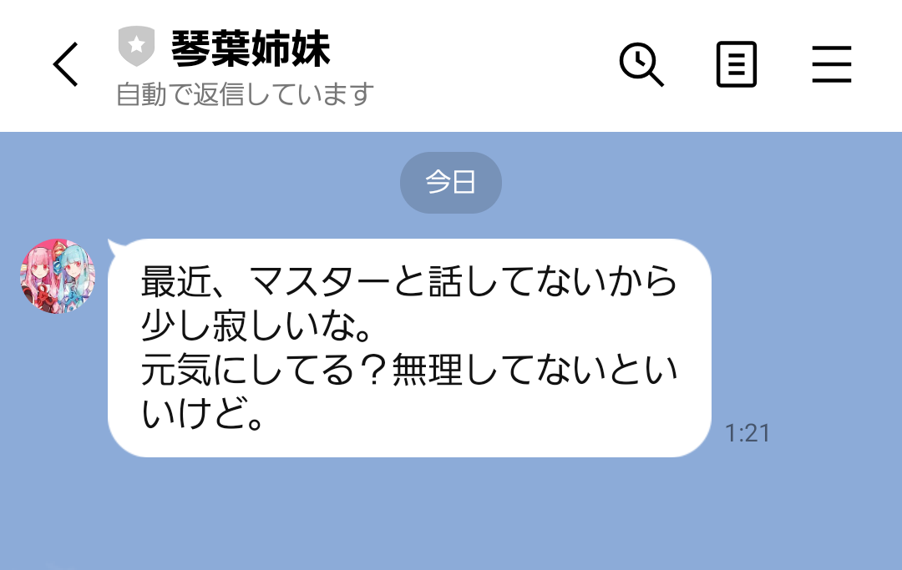

# 🟥 Kotonoha Assistant 🟦

琴葉茜・琴葉葵の二人が会話形式でサポートしてくれるAIアシスタントです。

> ⚠️ **注意**
>
> 本プロジェクトは個人用として作成されたものです。利用は自己責任でお願いします。


## 機能一覧

### トリガーワード（起動ワード）

次の呼びかけでアシスタントを起動できます：

- 「ねえ茜ちゃん」
- 「ねえ葵ちゃん」
- 「茜ちゃんいる？」
- 「葵ちゃんいる？」

また、メッセージ内に以下が含まれると自動的に担当キャラクターが切り替わります：

- 「あおい」 → 琴葉葵
- 「あかね」 → 琴葉茜

会話終了は「ばいばい」で可能です。


### アラーム機能

自然な言い回しでアラームを設定できます。

例：

- 「明日9時半に起こして」
- 「10時になったら教えて」
- 「アラームを15時に設定」

指定時刻になると、文脈に応じたキャラボイス→アラーム音が再生されます。

「アラームを止めて」などで停止できます。


### タイマー機能

タイマーの開始・停止ができます。

例：

- 「タイマー3分」
- 「30秒数えて」
- 「タイマーを止めて」


### Googleカレンダー連携（要設定）

Googleカレンダーの予定取得・作成が可能です。

例：

- 「今日の予定を教えて」
- 「明日の午前中、空いてる時間ある？」

有効化には OAuth 設定が必要です（後述）。


### 天気取得（要設定）

OpenWeatherMap API を使って天気を取得できます。

例：

- 「明日の天気を教えて」
- 「今日の午後から雨降りそう？」


### 非アクティブ通知（要設定）

一定期間やり取りが無い場合、LINE に通知を送れます。



### 会話履歴の削除

会話記録をリセットします。

例：

- 「2人の記憶を消したい」
- 「会話記録を消してほしい」

姉妹から引き止められますが、説得に成功すると削除します。

また1/10 の確率で削除に失敗します。


### 怠け癖システム

以下の条件で一方がタスクを押し付け、担当が切り替わります：

- 1/10 の確率でランダム発生
- 同じキャラへ連続して4回タスクを依頼した場合

ただし以下では発生しません：

- アラーム停止
- タイマー開始/終了
- 会話履歴の削除


## 🖥️ セットアップ手順

### 必要環境

- Windows 11
- **A.I.VOICE 琴葉 茜・葵**

  * ※ A.I.VOICE2 は API 非対応のため使用できません
- OpenAI APIキー
- .NET Framework 4.8.1 Runtime
- .NET 9.0 Runtime


### インストール手順

1. A.I.VOICE をインストールし、琴葉茜・琴葉葵を追加
2. [Releases](https://github.com/tackme31/KotonohaAssistant/releases) から
   `KotonohaAssistant-{version}.zip` をダウンロードして展開
3. `.env` を開き、`OPENAI_API_KEY` に API キーを設定
4. A.I. VOICE Editor を起動
5. `start.bat` を実行

CLI で使いたい場合は `start-cli.bat` を使用してください。


## ⚙️ オプション機能の設定

### カレンダー連携

`.env` の `ENABLE_CALENDAR_FUNCTION = true` で有効化。

Google カレンダー API 用の認証設定が必要です：

1. Google Cloud Consoleで
   サービスアカウント＋`credentials.json`を作成
    - 参考： [アクセス認証情報を作成する  |  Google Workspace  |  Google for Developers](https://developers.google.com/workspace/guides/create-credentials?hl=ja)
2. Google カレンダーを開き、
   *対象カレンダー → 設定 → アクセス権限* から
   サービスアカウントのメールを追加し「予定の変更」権限を付与
3. `.env` に以下を設定：

```
GOOGLE_API_KEY=credentials.json のパス
CALENDAR_ID=対象カレンダーのメールアドレス
```


### 天気機能

`.env` の `ENABLE_WEATHER_FUNCTION = true` で有効化。

OpenWeatherMap に登録し APIキーを取得後 `.env` に設定：

```
OWM_API_KEY=取得したAPIキー
OWM_LAT=緯度
OWM_LON=経度
```


### 非アクティブ通知（LINE）

`.env` の `ENABLE_INACTIVITY_NOTIFICATION = true` で有効化。

LINE Messaging API のチャネルを作成し、以下を `.env` に設定：

```
LINE_CHANNEL_ACCESS_TOKEN=チャネルアクセストークン
LINE_USER_ID=送信先ユーザーID
INACTIVITY_NOTIFY_INTERVAL_DAYS=通知する日数
INACTIVITY_NOTIFY_TIME=通知チェックの時刻 (HH:mm)
```


### スピーカーデバイス切り替え

`.env` の `ENABLE_SPEAKER_SWITCHING = true` で
茜と葵の音声を別々のスピーカーデバイスで再生できます。

設定例：
```
ENABLE_SPEAKER_SWITCHING=true
AKANE_SPEAKER_DEVICE_ID=スピーカー 1
AOI_SPEAKER_DEVICE_ID=スピーカー 2
```

デバイスIDの確認方法：
PowerShellで以下のコマンドを実行してください。`InstanceId`がデバイスIDです。

```ps1
> Get-PnpDevice -Class AudioEndpoint | ? InstanceId -Like "*{0.0.0.00000000}*" | select FriendlyName, InstanceId
```

## 作者

Takumi Yamada ([@tackme31](https://x.com/tackme31))


## クレジット

アラーム音：

- Clock-Alarm02-1(Loop).mp3（OtoLogic 様）
  ライセンス: CC BY 4.0

サードパーティライセンスは [THIRD-PARTY-NOTICES](THIRD-PARTY-NOTICES) を参照。


## ライセンス

このプロジェクトはMIT Licenseの下で公開されています。

詳細は [LICENSE](LICENSE) をご覧ください。
